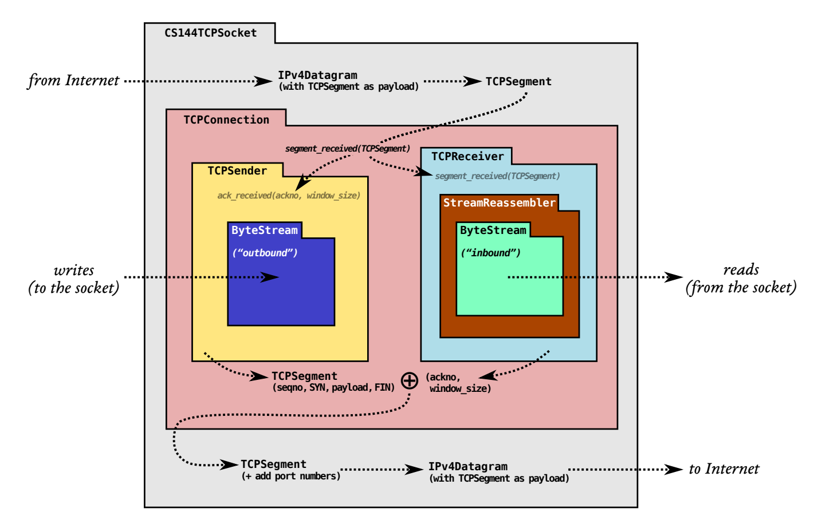
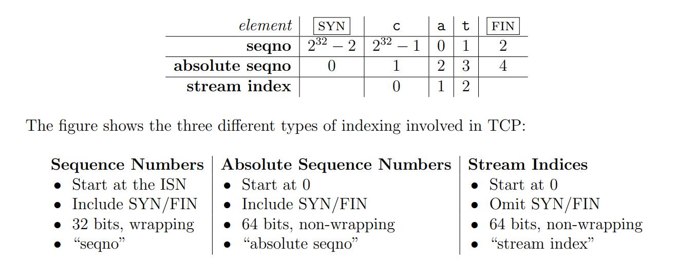
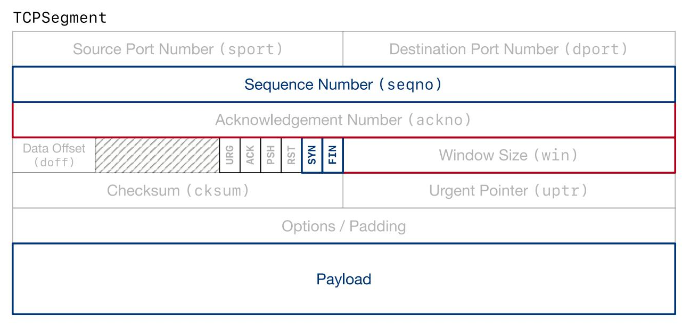

## Lab 2  the TCP receiver

### 1 实验注意事项

本实验要实现的是TCPReceiver，在StreamReassembler外层，主要功能是将收到的TCPSegment的seqno转成index，并把数据和index一起喂给StreamReassembler去组装。​	

1. 在StreamReassembler中每个字节有一个64位的index，在TCP首部由于空间问题，每个字节只能用32位的sequence number (seqno) 表示。
2. 为了提高安全性、避免同样的两端被以前的通信中的segments干扰，一段数据流的seqno并不是从零开始的，而是从一个随机的32位数(ISN)开始，往后则(ISN+1)%(2^32)
3. SYN和FIN标志并不属于数据流，但也占有sequence number
4. 字节流中使用的是index，在TCP首部传输时的是seqno，转换规则如下。

5. 

### 2 实验过程

#### part1 wrapping_integers

需要注意的就是有符号数、无符号数的存储与运算。

```c++
/* wrapping_integers.cc */
WrappingInt32 wrap(uint64_t n, WrappingInt32 isn) {
    //截取n的后32位并加上isn即可
    return WrappingInt32(((n << 32) >> 32) + isn.raw_value());
}

//! Transform a WrappingInt32 into an "absolute" 64-bit sequence number (zero-indexed)
//! \param n The relative sequence number
//! \param isn The initial sequence number
//! \param checkpoint A recent absolute 64-bit sequence number
//! \returns the 64-bit sequence number that wraps to `n` and is closest to `checkpoint`
//!
//! \note Each of the two streams of the TCP connection has its own ISN. One stream
//! runs from the local TCPSender to the remote TCPReceiver and has one ISN,
//! and the other stream runs from the remote TCPSender to the local TCPReceiver and
//! has a different ISN.
uint64_t unwrap(WrappingInt32 n, WrappingInt32 isn, uint64_t checkpoint) {
    //后32位是n - isn
    uint64_t backPart = n.raw_value() - isn.raw_value();
    //前32位是checkpoint的前32位
    uint64_t prePart = checkpoint & (0xFFFFFFFF00000000);
    uint64_t ans = prePart + backPart;
    //在ans,ans+1ul<<32,ans-1ul<<32三个中取距离checkpoint最近的一个
    //这里比较差值大小要用int64而不是unsigned int64，因为小数减大数我们需要的就是负数的绝对值
    if(abs(int64_t(ans + (1ul << 32) - checkpoint)) < abs(int64_t(ans - checkpoint)))
        return ans + (1ul << 32);
    //需要判断ans>=(1ul<<32),因为是int64。
    if(ans >= (1ul<<32) && abs(int64_t(ans - (1ul << 32) - checkpoint)) < abs(int64_t(ans - checkpoint)))
        return ans - (1ul << 32);
    return ans;
}
```


#### part 2 tcp_receiver

```c++
/* tcp_receiver.hh */
class TCPReceiver {
    //! Our data structure for re-assembling bytes.
    StreamReassembler _reassembler;

    //! The maximum number of bytes we'll store.
    size_t _capacity;
    WrappingInt32 _isn;
    bool _isn_set;
}
```

```c++
/* tcp_receiver.cc */
void TCPReceiver::segment_received(const TCPSegment &seg) {
    const TCPHeader header = seg.header();
    //先把seqno存下来，之后若检测到syn则+1，否则不变。
    WrappingInt32 seqno = header.seqno;
    if(header.syn){
        //isn就是第一个seqno
        _isn = header.seqno;
        _isn_set = true;
        seqno = seqno + 1;
    }
    //没收到syn，收到了其他segment时，直接返回。
    else if(_isn_set == false)
        return;
    //下面的index、absolute seqno、seqno的关系看讲义
    size_t checkpoint = _reassembler.stream_out().bytes_written();
    size_t abs_seqno = unwrap(seqno, _isn, checkpoint);
    size_t stream_index = abs_seqno - 1;
    //将数据写入字节流
    _reassembler.push_substring(seg.payload().copy(), stream_index, seg.header().fin);
}

optional<WrappingInt32> TCPReceiver::ackno() const {
    if(_isn_set == false)
        return std::nullopt;
    //如果已经收到FIN，因为FIN占用一个seqno，所以要比平时+1。
    if(_reassembler.stream_out().input_ended())
        return WrappingInt32(wrap(_reassembler.stream_out().bytes_written()+1, _isn)) + 1;
    return WrappingInt32(wrap(_reassembler.stream_out().bytes_written()+1, _isn));
}

size_t TCPReceiver::window_size() const {
//    return _capacity - _reassembler.unassembled_bytes();
    //
    return _capacity - (_reassembler.stream_out().bytes_written() - _reassembler.stream_out().bytes_read());
}
```

